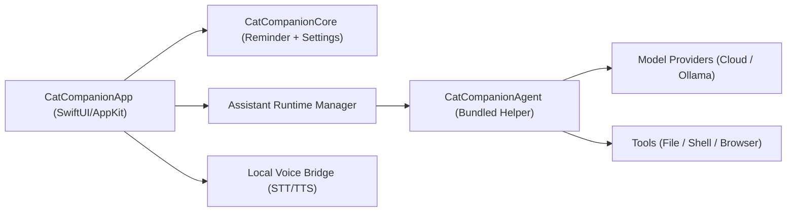

# 猫咪伴侣（CatCompanion）架构设计（方案 2）

## 1. 总体架构
采用 `主 App + 同 bundle 内置 Helper`。

## 2. 关键设计点
- 主 App 负责：
  - 用户界面与交互
  - 连续对话窗口（多轮会话）
  - 提醒引擎
  - 首次运行诊断向导（环境探测与修复引导）
  - 模型/权限/技能策略配置
  - Helper 生命周期与状态展示
  - 本地语音能力探测与编排（当前接入 CosyVoice 脚本桥接）
- Helper 负责：
  - AI 请求编排
  - 工具执行与隔离
  - 审计日志输出
- IPC：
  - 第一阶段：`stdio` 行协议（便于快速联调与可观测性）
  - 已接入 OpenClaw Gateway 最小链路：`config`（连通性探测）+ `ask`（chat.send）
  - 连续对话依赖固定 `sessionKey`，由 Gateway 侧维护上下文
  - 后续阶段：可迁移 XPC（不改变上层协议结构）

## 3. 配置模型
`AppSettings` 新增 `assistant`：
- enable/autoStart
- model route strategy（cloudPreferred / cloudOnly / localOnly）
- cloud primary + local fallback model
- action scope（readOnly/file/shell/browser）
- skill policy（第三方默认禁用 + 白名单）

## 4. 启动时序
1. App 启动提醒引擎。
2. 若 assistant.enable=true 且 autoStart=true，则尝试启动 Helper。
3. 主 App 发送 `ping` 健康探针。
4. 收到 `pong` 后标记 `ready`。
5. 若失败，状态标记 `unavailable`，保留重试入口。

## 5. 安全边界
- 默认最小权限，显式开关执行范围。
- shell/browser/file 写操作在后续执行链路中要求用户确认。
- 第三方 skills 默认关闭，白名单匹配后才可执行。

## 6. MAS 迁移策略
- 保持 UI/提醒/设置层复用。
- 替换/关闭高风险工具执行能力。
- 通过编译开关或 capability profile 生成阉割版。
